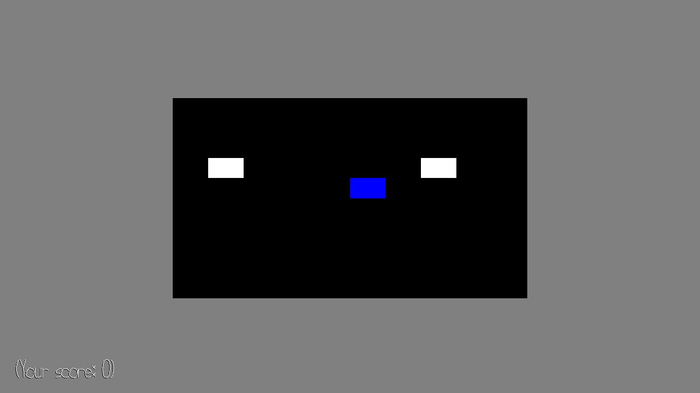
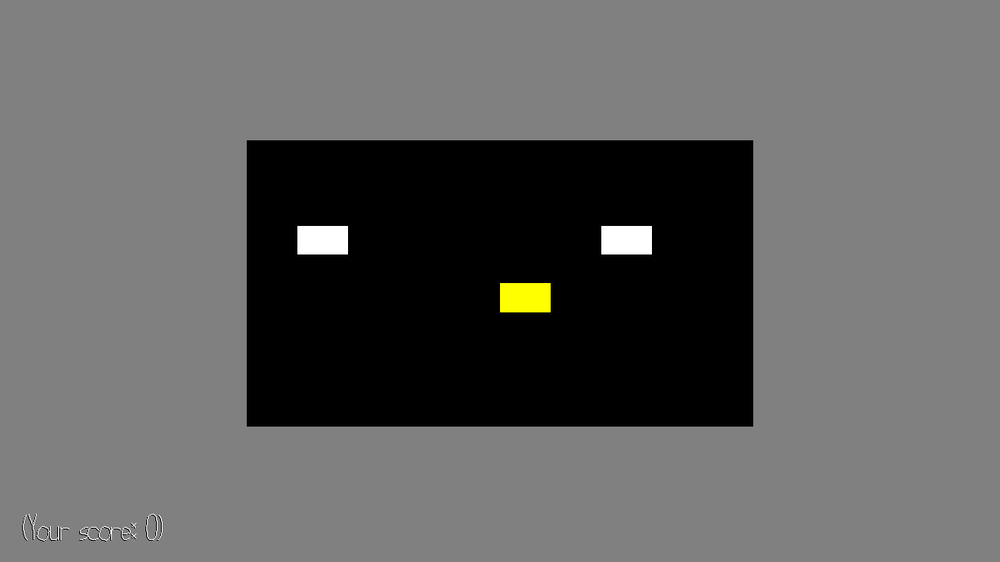

# Treasure Race

## Author: Gustavo Silvera

## Design: 
You are the blue tile, you (and other explorers) search for the golden tile. You must collect as much gold as possible before your competitor explorers do.

## Networking: 
This game implements networking by transmitting the client player's position and whether or not they have "dug" (pressed enter/space). The server concatenates this information from all the players and creates a 2D grid of how many players are on each tile, the server also contains the logic for tracking where the treasure is at any time, which it can reset when it has been "dug" by a player. 

The client transmission code is found in `PlayMode.cpp` as follows:
```c++
if (left.downs || right.downs || down.downs || up.downs || enter.downs) {
    client.connections.back().send('b');
    client.connections.back().send(static_cast<unsigned char>(pos.x));
    client.connections.back().send(static_cast<unsigned char>(pos.y));
    client.connections.back().send(enter.pressed);
}
```


The server reconstruction code is found in `server.cpp` as follows:
```c++
uint8_t pos_x = c->recv_buffer[1];
uint8_t pos_y = c->recv_buffer[2];
uint8_t enter_count = c->recv_buffer[3];

player.pos_x = pos_x;
player.pos_y = pos_y;
player.enter_pressed = enter_count;
if (player.pos_x == treasure_x && player.pos_y == treasure_y && player.enter_pressed > 0) {
    // randomize the treasure location
    do {
        treasure_x = rand() % (BOARD_WIDTH - 1);
        treasure_y = rand() % (BOARD_WIDTH - 1);
        // ensure won't randomly respawn on the same tile
    } while (treasure_x == player.pos_x || treasure_y == player.pos_y);
}

...

char board[msg_len] = { 0 };

for (auto& [c, player] : players) {
    int idx = player.pos_x + player.pos_y * BOARD_WIDTH;
    if (idx >= 0 && idx < msg_len)
        board[idx]++;
}

size_t treasure_idx = treasure_x + BOARD_WIDTH * treasure_y;
board[treasure_idx] = -board[treasure_idx];
```


The client reconstruction code is found in `PlayMode.cpp` as follows:
```c++
for (int i = 0; i < server_message.size(); i++) {
    int new_num_over = static_cast<int>(std::fabs(server_message[i]));
    board->board[i].delta = board->board[i].num_over - new_num_over;
    board->board[i].num_over = new_num_over;
    // treasure located if server message < 0
    board->board[i].treasure = (server_message[i] < 0);
    // colour treasure yellow
    board->board[i].colour_other = true; // colour with this colour
}
```

(TODO: How does your game implement client/server multiplayer? What messages are transmitted? Where in the code?)

## Screen Shot:


- Other explorers are drawn in white, you are drawn in blue.


- demonstration of the same scene with the current explorer (blue) moving 1-down and found a golden tile. 


## How To Play:
- Use the arrow keys to move your player around the grid world. 
- Press `enter` or `space` when you find the treasure!


## Sources: 
- Got help for openGL rendering from here: https://learnopengl.com/Getting-started/Hello-Triangle

This game was built with [NEST](NEST.md).

